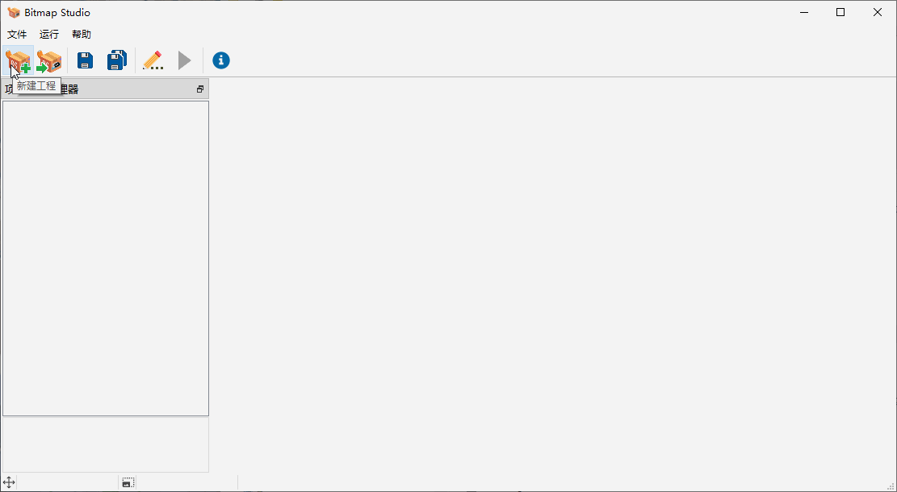

<div align=center>
  
</div>
<h1 align="center">
  Bitmap Studio
</h1>
<p align="center">
  🚩单片机OLED位图管理、编辑和自动取模软件
</p>


# 🚀 快速开始

## 获取软件

- 下载[release](https://github.com/luckyPtr/BitmapStudio/releases)

- 解压后运行 **Bitmap Studio.exe**

  （如果遇到缺少dll无法运行的情况，请安装Bitmap Studio.exe同文件夹下的VC++运行库vc_redist.x64.exe）

  或

- clone项目工程

  ```git
  clone git@github.com:luckyPtr/BitmapStudio.git
  ```

- 使用Qt Creator打开工程并编译


## 新建工程

- 点击新建工程按键
- 选择工程名称和路径
- 设置项目屏幕的尺寸和取模方式



