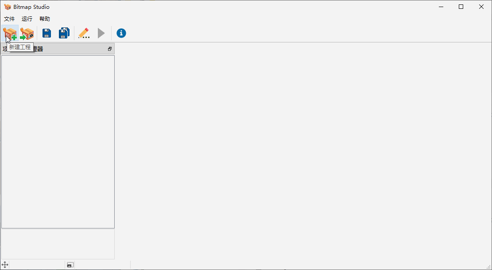
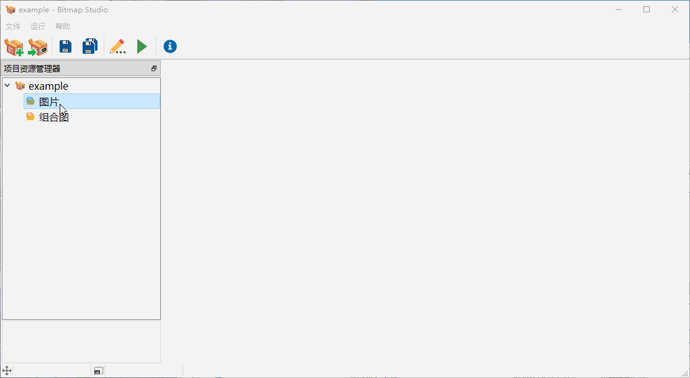
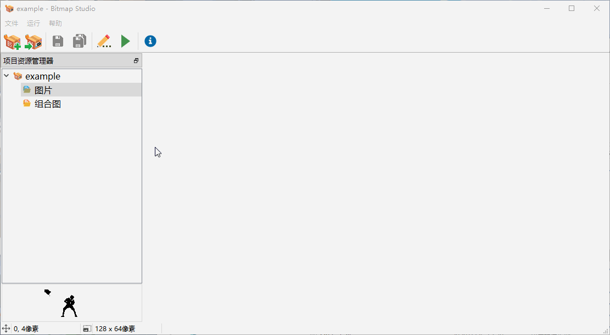
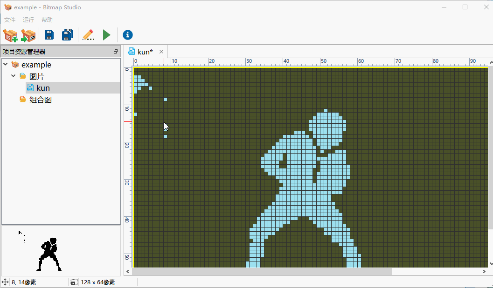
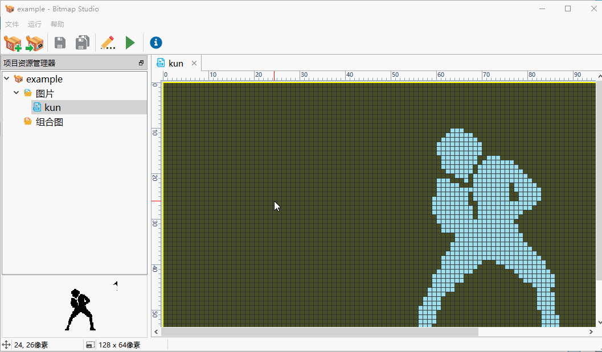

<div align=center>
  
</div>
<h1 align="center">
  Bitmap Studio
</h1>
<p align="center">
  🚩单片机OLED位图管理、编辑和自动取模软件
</p>


​	单片机LCD显示通常需要对图片进行取模，如果项目的图片数量比较多的话取模和图片管理就会很繁琐，本软件可以对项目涉及到的图片进行统一的管理，用户在单片机程序文件夹里新建Bitmap Studio工程（*.bs）后可直接使用该软件对图片进行导入、编辑、删除、浏览等，修改图片后可以一键生成C语言字模文件在单片机工程里，免去了传统取模和复制字模数组的工作


## 🚀 快速开始

### 获取软件

- 下载[release](https://github.com/luckyPtr/BitmapStudio/releases)

- 解压后运行 **Bitmap Studio.exe**

  （如果遇到缺少dll无法运行的情况，请安装Bitmap Studio.exe同文件夹下的VC++运行库vc_redist.x64.exe）

  或

- clone项目工程

  ```git
  git clone git@github.com:luckyPtr/BitmapStudio.git
  ```

- 使用Qt Creator打开工程并编译

### 新建工程

- 点击新建工程按键
- 选择工程名称和路径
- 设置项目屏幕的尺寸和取模方式



### 导入图片

#### 从图片文件导入

- 图片-右键-导入-图片
- 选择图片文件
- 设置图片名称
- 调整图片的取色阈值



#### 从字模导入

- 图片-右键-导入-自模
- 输入字模（剪贴板有字模会自动导入）
- 选择取模方式和图片尺寸
- 输入图片名称



### 图片编辑

可以对图片进行简单的编辑

- 像素编辑
- 位置变换
- 尺寸调整
- 旋转和镜像
- 反色



### 一键生成字模

- 点击**运行**一键生成导入图片的字模
- 生成.c/.h文件可直接在单片机工程中使用




## 📄 许可证

本项目采用 [GPL-3.0](./LICENSE) 许可证。

**输出例外条款**：使用 Bitmap Studio 生成的全部输出文件（包括但不限于 `bms_image.c/.h`、`bms_sprite.c/.h`、`bms.bin`、`bms.h`、`bms_typedef.h` 及 `.bms` 工程文件）属于使用者自己的作品，**不受 GNU GPL 约束**，可任意使用、修改和商用，无需开源。

